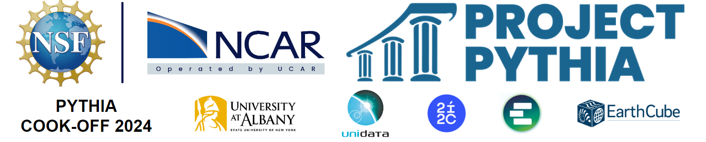
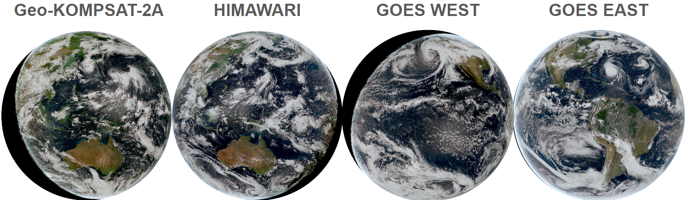

# Geostationary satellite Cookbook



[](https://github.com/ProjectPythia/geostationary-cookbook/actions/workflows/nightly-build.yaml)
[](https://binder.projectpythia.org/v2/gh/ProjectPythia/geostationary-cookbook/main?labpath=notebooks)
[](https://doi.org/10.5281/zenodo.14231916)

This **"Pythia Cookbook"** was started during the **Project Pythia June 11-14 2024 in Boulder, CO at the NCAR Mesa Lab**. The **"COOKBOOK GEOSAT"** aims to provide a comprehensive guide for utilizing Satpy to analyze geostationary satellite data of the sensor Advanced Baseline Imager ([ABI](https://www.goes-r.gov/spacesegment/abi.html)) on [GOES-R](https://www.goes-r.gov) (west and east), sensor Advanced Himawari Imager ([AHI](https://www.data.jma.go.jp/mscweb/en/himawari89/space_segment/spsg_ahi.html)) on [HIMAWARI](https://www.jma.go.jp/jma/jma-eng/satellite/himawari89.html), and sensor Advance Meteorological Imager (AMI) on [Geo-KOMPSAT-2A](https://nmsc.kma.go.kr/enhome/html/base/cmm/selectPage.do?page=satellite.gk2a.intro) (GK2A). [Satpy](https://satpy.readthedocs.io/en/stable/) is a powerful Python library specifically designed for processing and analyzing satellite data, offering capabilities for data visualization, manipulation, and analysis.



## Motivation


Satellite-based Earth observation is vital for global climate monitoring and disaster management. These systems provide critical data across a wide range of applications, including:

- Agriculture  
- Forest fires  
- Urbanization  
- Ice cover  
- Extreme weather  
- Atmospheric composition  
- Natural hazards such as cyclones and volcanic eruptions

The latest **third-generation geostationary satellites (GEOs)** significantly enhance these capabilities. With advanced features such as **RGB composite visualization**, **high-frequency sensing**, and **greater data availability**, these satellites are central to monitoring both atmospheric and terrestrial environments—especially for early detection and response to disasters.

Public access to data from NOAA’s third-generation GEOs—**GOES-16**, **GOES-17**, **GOES-18 (GOES-West)**, and **GOES-19 (GOES-East)**—is made possible through the **NOAA Open Data Dissemination (NODD) Program**, which partners with commercial cloud platforms like:

- **Microsoft Azure**
- **Amazon Web Services (AWS)**
- **Google Cloud Platform**

Additionally, AWS also hosts data from international 3rd-gen GEOs such as:

- **Himawari-8**
- **Geo-KOMPSAT-2A**

These partnerships enable **near real-time access** and **long-term data archives** for both domestic and global users.

To support weather services and disaster response agencies, 3rd-gen GEOs deliver **continuous, high-resolution monitoring** of key meteorological variables—such as cloud cover, temperature, and moisture—enabling better detection and forecasting of extreme weather events like **hurricanes**, **tornadoes**, and **floods**.

Finally, the **visualization of satellite data** in map-based formats is a critical task. It allows scientists, decision-makers, and emergency managers to:

- Identify risk patterns  
- Assess vulnerabilities  
- Improve early warning systems  
- Enhance disaster preparedness and planning


<p>
   
Public access to NOAA's geostationary satellite data, including HIMAWARI, GK2A, GOES-16, GOES-17, GOES-18, and GOES-19, is made possible through the NOAA Open Data Dissemination <a href="https://www.noaa.gov/information-technology/open-data-dissemination">NODD</a>
</p>  

<p>
   
A Python library called Satpy was created specifically for handling data from satellite instruments that observe the Earth. </p> 

## Authors
| Name      | Affiliation |
| ----------- | ----------- |
| [Jorge Bravo](https://github.com/jhbravo)                 | Stevens Institute of Technology |      |
| [Srihari (Hari) Sundar](https://github.com/sriharisundar) | National Renewable Energy Lab  |
| [Brian Mapes](https://github.com/brianmapes)              | Affiliation University of Miami |
| [Suman Shekhar](https://github.com/Sumanshekhar17)        | Rutgers University, The state university of New Jersey |
| [Tri Nguyen](https://github.com/tringuyen180303)          | Indiana University Bloomington |
| [Deborah Khider](https://github.com/khider)               | University of Southern California |

### Contributors

<a href="https://github.com/ProjectPythia/geostationary-cookbook/graphs/contributors">
  
</a>


## Structure
This development cookbook serves as an example of how to gather, handle, and present various geostationary satellite data types.

### Foundations
The ABI on the GOES-R series, the AHI on the Himawari satellites, and the AMI on the Geo-KOMPSAT-2A satellites all provide multi-channel visibility through their respective 16 spectral bands.

These sensors have several similarities in their spectral band configurations:

- All three instruments have bands covering the visible, near-infrared, and infrared portions of the electromagnetic spectrum.
- The central wavelengths of the spectral bands are comparable across the ABI, AHI, and AMI, enabling similar meteorological and environmental observations.
- The spatial resolutions of the bands also exhibit similarities, with the visible bands typically having finer spatial resolution

### Example workflows

Several notebooks with the following structure can be found in the notebooks directory:

- [00_geosat_explaining_steps.ipynb](notebooks/00_geosat_explaining_steps.ipynb):: provides a detailed explanation on how to download data and use Satpy to display it.

Given that you have read the 00_geosat_explaining_steps.ipynb and have a basic understanding of how to use Satpy, the following notebooks are designed without providing an explanation of the various sensors on each satellite.
- [99_auxiliar_dowloading.ipynb](notebooks/99_auxiliar_dowloading.ipynb): In order to run the subsequent notebooks, data must be downloaded from this notebook. 
- [01_geosat_ABI_GOES_east.ipynb](notebooks/01_geosat_ABI_GOES_east.ipynb): notebook to read ABI sensor data locally on GOES-east
- [02_geosat_ABI_GOES_west.ipynb](notebooks/02_geosat_ABI_GOES_west.ipynb): notebook to read ABI sensor data locally on GOES-west
- [03_geosat_AHI_HIMAWARI.ipynb](notebooks/03_geosat_AHI_HIMAWARI.ipynb): notebook to read AHI sensor data locally on HIMAWARI
- [04_geosat_AMI_GK2A.ipynb](notebooks/04_geosat_AMI_GK2A.ipynb): notebook for reading AMI sensor data locally on GeoKomposat

## Running the Notebooks

You can either run the notebook using [Binder](https://binder.projectpythia.org/) or on your local machine.

### Running on Binder

The simplest way to interact with a Jupyter Notebook is through
[Binder](https://binder.projectpythia.org/), which enables the execution of a
[Jupyter Book](https://jupyterbook.org) in the cloud. The details of how this works are not
important for now. All you need to know is how to launch a Pythia
Cookbooks chapter via Binder. Simply navigate your mouse to
the top right corner of the book chapter you are viewing and click
on the rocket ship icon, (see figure below), and be sure to select
“launch Binder”. After a moment you should be presented with a
notebook that you can interact with. I.e. you’ll be able to execute
and even change the example programs. You’ll see that the code cells
have no output at first, until you execute them by pressing
{kbd}`Shift`/+{kbd}`Enter`. Complete details on how to interact with
a live Jupyter notebook are described in [Getting Started with
Jupyter](https://foundations.projectpythia.org/foundations/getting-started-jupyter).

### Running on Your Own Machine

If you are interested in running this material locally on your computer, you will need to follow this workflow:

(Replace "geostationary-cookbook" with the title of your cookbooks)

1. Clone the `https://github.com/ProjectPythia/geostationary-cookbook` repository:

   ```bash
    git clone https://github.com/ProjectPythia/geostationary-cookbook.git
   ```

1. Move into the `geostationary-cookbook` directory
   ```bash
   cd geostationary-cookbook
   ```
1. Create and activate your conda environment from the `environment.yml` file
   ```bash
   conda env create -f environment.yml
   conda activate geostationary-cookbook
   ```
1. Move into the `notebooks` directory and start up Jupyterlab
   ```bash
   cd notebooks/
   jupyter lab
   ```
